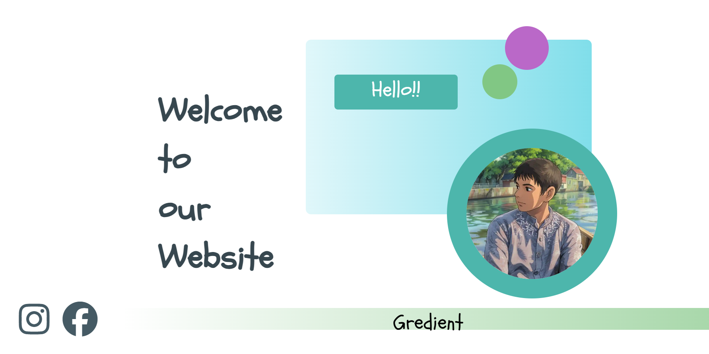

<h1 align="center">📚 Class Evaluation - 5</h1>

  
  

---

## ✉️ Invitation

Welcome to my **Class Evaluation - 5** submission!  
This repository contains my work for the evaluation, showcasing my progress and learning.

---

## 🧾 Details

- **Name**: Bepara Ram Das
- **Student ID**: `04325105101038`
- **Project Type**: Class Evaluation Submission
- **Topic**: Invitation

---
## 🖼️ Preview / ScreenShot

---

## 📌 Notes

Feel free to explore, fork, or reach out if you have any feedback or questions!

---

  <i>Made with ❤ by Vepada</i>

